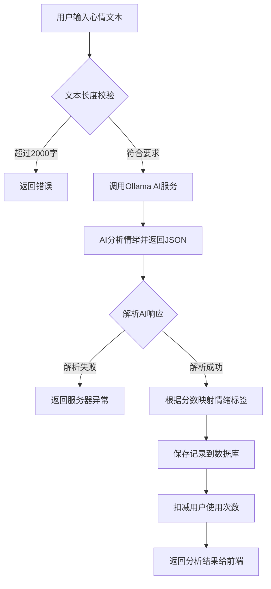
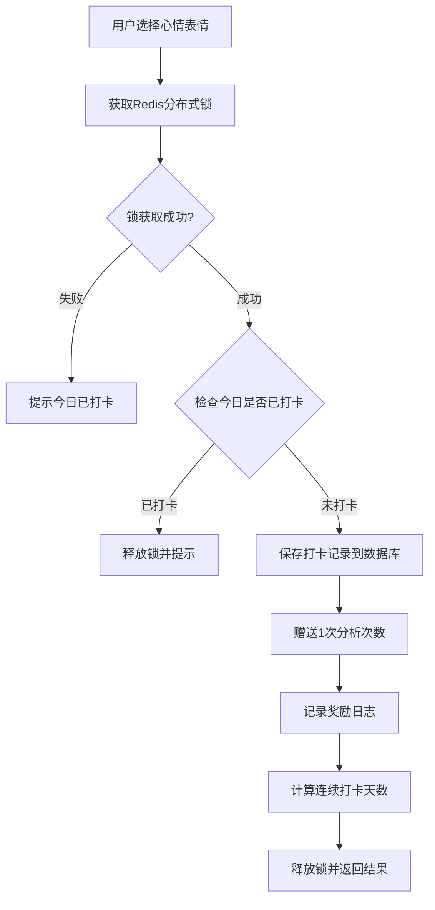
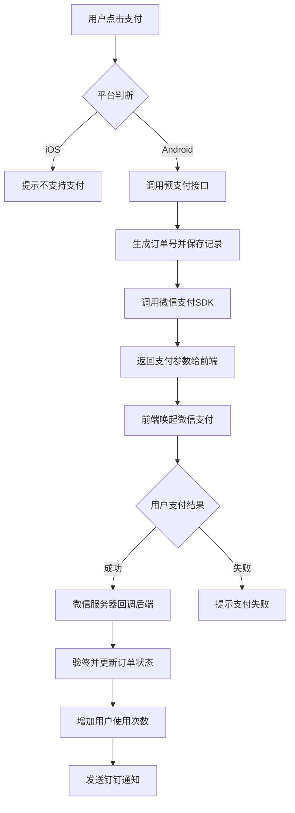
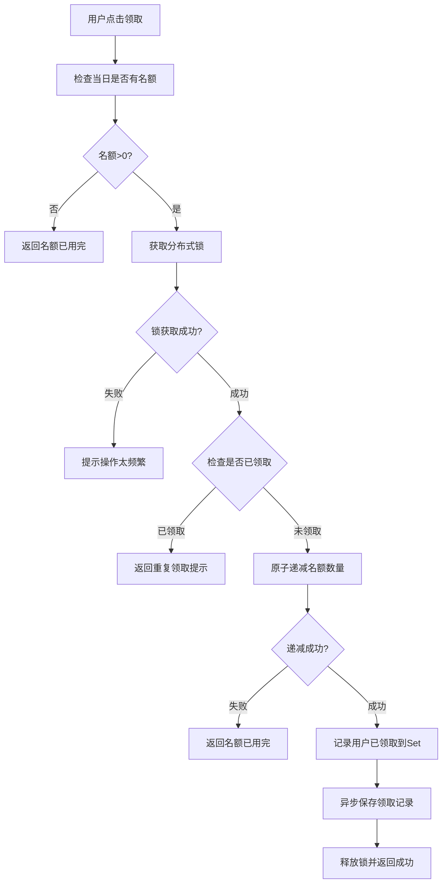

# AI情绪日记微信小程序项目分析

## 一、项目概述

### 1.1 项目简介
"AI情绪日记"是一款基于微信小程序的情绪管理应用，通过AI技术对用户输入的心情描述进行情绪分析，提供情绪评分、建议和统计数据，帮助用户更好地了解和管理自己的情绪状态。

### 1.2 技术栈

**前端（miniprogram）：**
- 微信小程序原生框架
- WxCharts图表组件
- 自定义组件：tab-bar、step-list、loading

**后端（backend）：**
- Java Spring Boot
- MyBatis Plus
- Spring AI（集成Ollama AI模型）
- Redis（分布式锁、缓存）
- 微信支付SDK
- MySQL数据库

---

## 二、功能模块拆解

### 2.1 功能模块总览

| 功能名称 | 前端页面路径 | 主要作用 |
|---------|------------|---------|
| 首页/今日心语 | pages/home/index | 展示每日励志语录，支持点赞/点踩反馈 |
| 情绪记录/分析 | pages/index/index | 用户输入心情文本，AI分析情绪，快速打卡 |
| 回忆录/统计 | subpage1/pages/reminisce/index | 历史情绪记录查看、数据统计、趋势图表 |
| 排行榜 | subpage1/pages/ranking/index | 用户情绪分析次数排行（总次数/平均分数） |
| 支付中心 | subpage1/pages/payment/index | 查看订单、发起支付、申请退款 |
| 每日名额 | subpage1/pages/daily-bonus/index | 领取免费情绪分析名额 |
| 签到功能 | （集成在首页） | 快速心情打卡，连续签到奖励 |

---

## 三、接口映射详解

### 3.1 用户认证模块

#### 3.1.1 微信登录获取Token
- **前端调用**：`utils/request.js` → `loginWithWechat()`
- **后端接口**：`GET /user/api/v2/getOpenId?code={code}`
- **控制器**：[UserController.java](../../backend/api/src/main/java/com/emotion/api/controller/UserController.java#L196-L203)
- **业务流程**：
  1. 前端调用 `wx.login()` 获取临时code
  2. 将code发送给后端 `/user/api/v2/getOpenId`
  3. 后端调用微信API换取openId和sessionKey
  4. 生成JWT Token并返回给前端
  5. 前端存储token到localStorage

```javascript
// 前端代码示例
wx.login({
  success(loginRes) {
    const code = loginRes.code;
    request({
      url: '/user/api/v2/getOpenId?code=' + code,
      method: 'GET'
    }).then(res => {
      wx.setStorageSync('token', res.data.token);
      wx.setStorageSync('id', res.data.id);
    });
  }
});
```

---

### 3.2 今日心语模块（pages/home/index）

#### 3.2.1 获取今日心语
- **前端调用**：`request({ url: '/daily-motivation/api/v1/getMotivation', method: 'GET' })`
- **后端接口**：`GET /daily-motivation/api/v1/getMotivation`
- **控制器**：[DailyMotivationController.java](../../backend/api/src/main/java/com/emotion/api/controller/DailyMotivationController.java#L28-L33)
- **返回数据**：
  ```json
  {
    "motivationContent": "今天也要开心哦～",
    "totalLikes": 123,
    "totalDislikes": 5
  }
  ```

#### 3.2.2 心语反馈（点赞/点踩）
- **前端调用**：`request({ url: '/daily-motivation/api/v1/motivationFeedback?feedbackType={type}', method: 'GET' })`
- **后端接口**：`GET /daily-motivation/api/v1/motivationFeedback?feedbackType={1|2}`
- **控制器**：[DailyMotivationController.java](../../backend/api/src/main/java/com/emotion/api/controller/DailyMotivationController.java#L59-L75)
- **参数说明**：
  - `feedbackType=1`：点赞
  - `feedbackType=2`：点踩

---

### 3.3 情绪分析模块（pages/index/index）

#### 3.3.1 提交文本进行情绪分析
- **前端调用**：`request({ url: '/user/api/v1/submitText', method: 'POST', data: { text: '...' } })`
- **后端接口**：`POST /user/api/v1/submitText`
- **控制器**：[UserController.java](../../backend/api/src/main/java/com/emotion/api/controller/UserController.java#L216-L306)
- **请求体**：
  ```json
  {
    "text": "今天工作很累，但完成了一个重要项目"
  }
  ```
- **返回数据**：
  ```json
  {
    "data": {
      "emotion": "满足",
      "emotionRatio": 65,
      "reminder": "你做得很好，继续保持积极心态"
    }
  }
  ```

**核心业务逻辑**：
1. **文本校验**：检查文本长度不超过2000字符
2. **AI情绪分析**：调用Ollama AI服务进行分析
   - Service层：[OllamaChatService.analyzeEmotion()](../../backend/api/src/main/java/com/emotion/api/service/OllamaChatService.java#L70-L80)
   - AI Prompt：要求AI返回JSON格式，包含score(1-100)和suggestion字段
3. **情绪标签映射**：根据分数转换为中文情绪标签
   ```
   1-10: 绝望 | 11-20: 痛苦 | 21-30: 愤怒 | 31-40: 沮丧
   41-50: 平静 | 51-60: 好奇 | 61-70: 满足 | 71-80: 开心
   81-90: 兴奋 | 91-100: 狂喜
   ```
4. **数据持久化**：保存到 `user_text_interactions` 表
5. **扣减使用次数**：减少用户的可用分析次数

**AI服务集成**：
- 使用Spring AI框架调用本地Ollama服务
- Ollama配置：[OllamaConfig.java](../../backend/api/src/main/java/com/emotion/api/config/OllamaConfig.java)
- 流式输出支持：`/user/api/v1/submitTextStream`（SSE实时返回）

#### 3.3.2 获取剩余使用次数
- **前端调用**：`request({ url: '/user/getRemaining', method: 'GET' })`
- **后端接口**：`GET /user/getRemaining`
- **控制器**：[UserController.java](../../backend/api/src/main/java/com/emotion/api/controller/UserController.java#L544-L553)
- **返回数据**：
  ```json
  {
    "data": {
      "daily": 5,
      "total": 20
    }
  }
  ```
  - `daily`：今日剩余次数
  - `total`：总剩余次数

#### 3.3.3 观看广告获取次数
- **前端调用**：`request({ url: '/user/grantReward?param=2222', method: 'GET' })`
- **后端接口**：`GET /user/grantReward?param={param}`
- **控制器**：[UserController.java](../../backend/api/src/main/java/com/emotion/api/controller/UserController.java#L559-L579)
- **业务流程**：
  1. 前端展示激励视频广告（adUnitId: `adunit-1ff3406970f5b729`）
  2. 用户完整观看后调用后端接口
  3. 后端使用Redis分布式锁防止重复领取
  4. 增加用户总使用次数3次
  5. 记录奖励日志到 `reward_record` 表

#### 3.3.4 快速打卡
- **前端调用**：`request({ url: '/sign-in/api/v1/quickCheckIn', method: 'POST', data: { moodEmoji: '😊', moodType: 1 } })`
- **后端接口**：`POST /sign-in/api/v1/quickCheckIn`
- **控制器**：[SignInController.java](../../backend/api/src/main/java/com/emotion/api/controller/SignInController.java#L28-L49)
- **Service实现**：[SignInServiceImpl.java](../../backend/api/src/main/java/com/emotion/api/service/impl/SignInServiceImpl.java#L58-L120)
- **请求体**：
  ```json
  {
    "moodEmoji": "😊",
    "moodType": 1,
    "longitude": 116.404,
    "latitude": 39.915
  }
  ```
- **情绪类型映射**：
  - 1: 开心 (75分)
  - 2: 平静 (45分)
  - 3: 悲伤 (35分)
  - 4: 愤怒 (25分)
  - 5: 疲惫 (15分)

**业务流程**：
1. Redis分布式锁防止重复打卡（key: `checkin:{userId}:{date}`）
2. 检查今日是否已打卡
3. 保存打卡记录到 `user_text_interactions` 表（type=1表示签到）
4. 赠送1次分析次数
5. 计算连续打卡天数
6. 返回奖励信息和连续天数

#### 3.3.5 查询今日打卡状态
- **前端调用**：`request({ url: '/sign-in/api/v1/todayStatus', method: 'GET' })`
- **后端接口**：`GET /sign-in/api/v1/todayStatus`
- **控制器**：[SignInController.java](../../backend/api/src/main/java/com/emotion/api/controller/SignInController.java#L56-L65)
- **返回数据**：
  ```json
  {
    "data": {
      "hasCheckedIn": true,
      "consecutiveDays": 7,
      "remainingRemakeCount": 3
    }
  }
  ```

---

### 3.4 回忆录/统计模块（subpage1/pages/reminisce/index）

#### 3.4.1 获取数据统计概览
- **前端调用**：`request({ url: '/user/api/v1/getTiAnalysisData', method: 'GET' })`
- **后端接口**：`GET /user/api/v1/getTiAnalysisData?type={0|1}`
- **控制器**：[UserController.java](../../backend/api/src/main/java/com/emotion/api/controller/UserController.java#L633-L644)
- **返回数据**：
  ```json
  {
    "data": {
      "totalCount": 50,
      "totalAvgScore": 65.5,
      "weekAvgScore": 68.2,
      "monthAvgScore": 63.8
    }
  }
  ```
  - `totalCount`：总记录数
  - `totalAvgScore`：总体平均分
  - `weekAvgScore`：本周平均分
  - `monthAvgScore`：本月平均分

#### 3.4.2 获取历史记录列表
- **前端调用**：`request({ url: '/user/api/v1/historySubmit?page=1&size=20', method: 'GET' })`
- **后端接口**：`GET /user/api/v1/historySubmit?page={page}&size={size}&type={0|1}`
- **控制器**：[UserController.java](../../backend/api/src/main/java/com/emotion/api/controller/UserController.java#L581-L589)
- **返回数据**：
  ```json
  {
    "data": {
      "records": [
        {
          "createTime": "2024-01-15 14:30:00",
          "inputText": "今天心情不错",
          "emotion": "开心",
          "score": 75,
          "reminder": "保持好心情",
          "imgId": []
        }
      ],
      "total": 50,
      "pages": 3,
      "current": 1
    }
  }
  ```

#### 3.4.3 获取心情趋势数据（折线图）
- **前端调用**：`request({ url: '/user/api/v1/lineChart', method: 'GET' })`
- **后端接口**：`GET /user/api/v1/lineChart`
- **控制器**：[UserController.java](../../backend/api/src/main/java/com/emotion/api/controller/UserController.java#L598-L603)
- **返回数据**：
  ```json
  {
    "data": [
      {
        "time": "01-10",
        "score": 65
      },
      {
        "time": "01-11",
        "score": 72
      }
    ]
  }
  ```
- **前端渲染**：使用WxCharts组件绘制折线图
  - Canvas ID: `moodTrendChart`
  - Y轴范围：0-100
  - 颜色：#6C5CE7（紫色）

---

### 3.5 排行榜模块（subpage1/pages/ranking/index）

#### 3.5.1 获取用户排行榜
- **前端调用**：`request({ url: '/rank/api/v1/getUserRank?type=1', method: 'GET' })`
- **后端接口**：`GET /rank/api/v1/getUserRank?type={1|2}`
- **控制器**：[RankController.java](../../backend/api/src/main/java/com/emotion/api/controller/RankController.java#L26-L32)
- **参数说明**：
  - `type=1`：按总次数排行
  - `type=2`：按平均分数排行
- **返回数据**：
  ```json
  {
    "data": [
      {
        "userName": "用户A",
        "total": 100,
        "avg": 72.5
      },
      {
        "userName": "用户B",
        "total": 85,
        "avg": 68.3
      }
    ]
  }
  ```

---

### 3.6 支付模块（subpage1/pages/payment/index）

#### 3.6.1 获取支付订单列表
- **前端调用**：`request({ url: '/pay/list/payments', method: 'GET' })`
- **后端接口**：`GET /pay/list/payments`
- **控制器**：[PaymentController.java](../../backend/api/src/main/java/com/emotion/api/controller/PaymentController.java#L96-L101)
- **返回数据**：订单列表，包含订单号、金额、状态、时间等

#### 3.6.2 发起预支付
- **前端调用**：`request({ url: '/pay/prepay?type=1', method: 'GET' })`
- **后端接口**：`GET /pay/prepay?type={1}`
- **控制器**：[PaymentController.java](../../backend/api/src/main/java/com/emotion/api/controller/PaymentController.java#L75-L93)
- **业务流程**：
  1. 生成唯一订单号（outTradeNo）
  2. 保存支付记录到 `wechat_payment_records` 表（状态：PREPAY）
  3. 调用微信支付SDK生成预支付订单
  4. 返回支付参数给前端（timeStamp, nonceStr, packageVal, signType, paySign）
  5. 前端调用 `wx.requestPayment()` 唤起微信支付
  6. 支付成功后微信服务器回调 `/pay/xiajing/onekey/prepay/notify`
  7. 后端验证签名，更新订单状态为SUCCESS
  8. 增加用户总使用次数

**支付回调处理**：
```java
@PostMapping("/xiajing/onekey/prepay/notify")
public void payNotify(@RequestHeader(...) String wechatSignature, ...) {
  // 1. 构建验签参数
  // 2. 使用NotificationParser验签解密
  // 3. 更新支付记录状态
  // 4. 增加用户使用次数
  // 5. 发送钉钉通知
}
```

#### 3.6.3 申请退款
- **前端调用**：`request({ url: '/pay/refund?outTradeNo={no}&reason=7天无理由退款', method: 'GET' })`
- **后端接口**：`GET /pay/refund?outTradeNo={no}&reason={reason}`
- **控制器**：[PaymentController.java](../../backend/api/src/main/java/com/emotion/api/controller/PaymentController.java#L103-L124)
- **业务流程**：
  1. 生成唯一退款单号
  2. 验证订单归属（防止恶意退款）
  3. 更新退款申请状态为APPLY
  4. 调用微信支付SDK发起退款
  5. 微信服务器回调 `/pay/xiajing/onekey/refund/notify`
  6. 更新退款状态为SUCCESS

---

### 3.7 每日名额模块（subpage1/pages/daily-bonus/index）

#### 3.7.1 获取剩余名额数量
- **前端调用**：`request({ url: '/emotion/quota/count', method: 'POST' })`
- **后端接口**：`POST /emotion/quota/count`
- **控制器**：[EmotionQuotaController.java](../../backend/api/src/main/java/com/emotion/api/controller/EmotionQuotaController.java#L38-L48)
- **实现逻辑**：
  - 从Redis读取当日名额：key = `{yyyyMMdd}emotion`
  - 返回剩余数量，如果为null则返回0

#### 3.7.2 领取名额
- **前端调用**：`request({ url: '/emotion/quota/acquire', method: 'POST' })`
- **后端接口**：`POST /emotion/quota/acquire`
- **控制器**：[EmotionQuotaController.java](../../backend/api/src/main/java/com/emotion/api/controller/EmotionQuotaController.java#L55-L122)
- **业务流程**：
  1. 检查当日是否有可用名额
  2. 获取分布式锁（key: `{date}emotion:lock:{userId}`，超时10秒）
  3. 检查用户今日是否已领取（Redis Set: `{date}emotion:acquired_users`）
  4. 原子递减名额数量（`redisUtil.decrementIfPositive()`）
  5. 记录用户已领取到Set集合
  6. 异步保存领取记录到 `activity_free_usage` 表
  7. 释放分布式锁

**并发控制**：
- 使用Redis分布式锁防止同一用户重复领取
- 使用原子操作 `decrementIfPositive()` 确保名额不会超发
- Set集合记录已领取用户，防止重复

#### 3.7.3 获取领取历史记录
- **前端调用**：`request({ url: '/emotion/quota/history', method: 'POST' })`
- **后端接口**：`POST /emotion/quota/history`
- **控制器**：[EmotionQuotaController.java](../../backend/api/src/main/java/com/emotion/api/controller/EmotionQuotaController.java#L127-L144)
- **返回数据**：领取记录列表，包含用户ID（脱敏）、领取时间、奖励次数
- **隐私保护**：用户openId只显示后5位，当前用户会标记"←这是我"

---

## 四、核心业务逻辑详解

### 4.1 AI情绪分析流程



**关键代码位置**：
- Controller: [UserController.submitText()](../../backend/api/src/main/java/com/emotion/api/controller/UserController.java#L216-L306)
- Service: [OllamaChatService.analyzeEmotion()](../../backend/api/src/main/java/com/emotion/api/service/OllamaChatService.java#L70-L80)
- DTO: [EmotionAnalysisResponse](../../backend/api/src/main/java/com/emotion/api/dto/EmotionAnalysisResponse.java)

**AI Prompt设计**：
```
请分析以下文本的情绪，并给出一个1-100的情绪分数和一句简短的建议或安慰语。
分数定义：1-10绝望，11-20痛苦，21-30愤怒，31-40沮丧，41-50平静，51-60好奇，61-70满足，71-80开心，81-90兴奋，91-100狂喜
文本内容：{用户输入}

请以JSON格式返回，包含score(整数1-100)和suggestion(字符串)两个字段。
```

---

### 4.2 用户认证与Token管理

**认证流程**：
1. **首次登录**：
   - 前端调用 `wx.login()` 获取code
   - 后端用code换取openId和sessionKey
   - 生成JWT Token返回前端
   - 前端存储token到 `wx.getStorageSync('token')`

2. **请求拦截**：
   - `utils/request.js` 自动注入 `Authorization: Bearer {token}`
   - 非登录接口都需要token

3. **Token失效处理**：
   - 收到401响应时，清除token
   - 记录401错误计数（最多5次）
   - 超过5次后1小时内不再自动重试
   - 由调用方决定是否重新登录

**关键代码**：
- 前端：[utils/request.js](../../miniprogram/utils/request.js#L84-L122)
- 后端：[JwtTokenUtil.java](../../backend/api/src/main/java/com/emotion/api/config/JwtTokenUtil.java)
- 过滤器：[JwtRequestFilter.java](../../backend/api/src/main/java/com/emotion/api/config/JwtRequestFilter.java)

---

### 4.3 快速打卡与连续签到

**打卡流程**：


**连续天数计算逻辑**：
1. 查询用户所有签到记录（type=1），按时间倒序
2. 检查最后一次打卡是否为今天或昨天
3. 如果不是，连续天数为0
4. 如果是，遍历记录计算连续天数
5. 跳过同一天多次打卡的情况

**关键代码**：
- Service: [SignInServiceImpl.calculateConsecutiveDays()](../../backend/api/src/main/java/com/emotion/api/service/impl/SignInServiceImpl.java#L149-L192)
- 分布式锁：`redisUtil.lock("checkin:" + userId + ":" + LocalDate.now(), ...)`

---

### 4.4 支付与退款流程

**支付流程**：


**退款流程**：
1. 用户点击退款按钮
2. 生成唯一退款单号
3. 验证订单归属（防止恶意退款）
4. 更新退款申请状态为APPLY
5. 调用微信支付SDK发起退款
6. 微信服务器异步回调通知退款结果
7. 更新退款状态为SUCCESS

**关键代码**：
- Controller: [PaymentController](../../backend/api/src/main/java/com/emotion/api/controller/PaymentController.java)
- 支付SDK: `com.wechat.pay.java.service.payments.jsapi`
- 退款SDK: `com.wechat.pay.java.service.refund`

---

### 4.5 每日名额领取（高并发场景）

**并发控制策略**：


**关键技术点**：
1. **分布式锁**：防止同一用户并发请求
   - Key: `{date}emotion:lock:{userId}`
   - 超时时间：10秒
   
2. **原子操作**：确保名额不会超发
   - `redisUtil.decrementIfPositive(redisKey)`
   - 只有当值>0时才递减
   
3. **Set集合去重**：记录已领取用户
   - Key: `{date}emotion:acquired_users`
   - 使用 `sismember()` 检查是否已领取

**关键代码**：
- Controller: [EmotionQuotaController.acquireQuota()](../../backend/api/src/main/java/com/emotion/api/controller/EmotionQuotaController.java#L55-L122)
- Redis工具：`redisUtil.lock()`, `redisUtil.decrementIfPositive()`, `redisUtil.sadd()`

---

### 4.6 数据统计与趋势分析

**统计维度**：
1. **总体统计**：
   - 总记录数（totalCount）
   - 总体平均分数（totalAvgScore）
   
2. **时间维度**：
   - 本周平均分（weekAvgScore）
   - 本月平均分（monthAvgScore）

3. **趋势图表**：
   - 最近N天的情绪分数变化
   - 使用折线图展示

**数据库查询优化**：
- 使用MyBatis Plus的LambdaQueryWrapper构建动态查询
- 对常用查询字段建立索引（userId, signInTime, type）
- 分页查询避免一次性加载大量数据

**前端可视化**：
- 使用WxCharts组件绘制折线图
- 数字动画效果增强用户体验
- 支持下拉刷新和上拉加载更多

---

## 五、数据库设计要点

### 5.1 核心数据表

| 表名 | 用途 | 关键字段 |
|-----|------|---------|
| user | 用户信息 | id, open_id, username |
| user_text_interactions | 情绪记录 | id, user_id, input_text, score, emotion, sign_in_time, type |
| user_function_record | 用户功能记录 | id, user_id, total_usage_limit, used_times_today, daily_limit_times |
| wechat_payment_records | 支付记录 | id, user_id, out_trade_no, amount, status, refund_status |
| reward_record | 奖励记录 | id, user_id, param, reward_count, create_time |
| activity_free_usage | 活动名额领取 | id, open_id, grab_time, reward_usage_count |
| daily_motivation | 每日心语 | id, content, total_likes, total_dislikes |

### 5.2 索引建议
- `user_text_interactions`: (user_id, sign_in_time), (user_id, type)
- `wechat_payment_records`: (user_id, out_trade_no)
- `activity_free_usage`: (open_id, grab_time)

---

## 六、第三方服务集成

### 6.1 微信开放平台
- **登录授权**：`https://api.weixin.qq.com/sns/jscode2session`
- **激励视频广告**：adUnitId: `adunit-1ff3406970f5b729`
- **微信支付**：JSAPI支付、退款接口

### 6.2 Ollama AI服务
- **本地部署**：通过Spring AI集成
- **模型调用**：使用ChatClient进行对话
- **结构化输出**：要求AI返回JSON格式
- **流式输出**：支持SSE实时推送

### 6.3 Redis
- **分布式锁**：防止并发问题
- **缓存**：存储每日名额、用户状态
- **Set集合**：记录已领取用户

### 6.4 钉钉通知
- **支付回调**：发送支付成功通知
- **退款回调**：发送退款成功通知
- **系统监控**：发送JVM内存信息

---

## 七、安全与性能优化

### 7.1 安全措施
1. **JWT Token认证**：所有接口需要Bearer Token
2. **分布式锁**：防止重复提交、并发冲突
3. **订单归属验证**：退款时验证订单属于当前用户
4. **参数校验**：文本长度、情绪类型等合法性检查
5. **敏感信息脱敏**：用户openId只显示后5位

### 7.2 性能优化
1. **Redis缓存**：热点数据缓存（名额、用户状态）
2. **分页查询**：避免一次性加载大量数据
3. **异步处理**：奖励记录异步保存
4. **连接池**：数据库连接池、HTTP连接池
5. **懒加载**：子包按需加载，减少首屏时间

### 7.3 异常处理
1. **401统一处理**：token失效时不显示提示，由调用方决定
2. **超时处理**：请求超时60秒，显示友好提示
3. **重试机制**：401错误最多重试5次，1小时后清零
4. **错误码规范**：使用统一的BaseResult封装返回结果

---

## 八、项目亮点总结

1. **AI驱动**：集成Ollama本地AI模型，提供智能情绪分析
2. **高并发设计**：使用Redis分布式锁和原子操作处理名额领取
3. **完整支付链路**：支持微信支付、退款、订单管理
4. **数据可视化**：折线图展示情绪趋势，数字动画增强体验
5. **用户激励体系**：签到奖励、广告奖励、付费购买多种方式
6. **社交属性**：排行榜功能促进用户互动
7. **安全可靠**：JWT认证、分布式锁、参数校验多重保障

---

## 九、改进建议

1. **流式分析优化**：目前前端未使用 `/submitTextStream` 接口，可改为SSE实时显示AI分析过程
2. **缓存优化**：统计数据可加入Redis缓存，减少数据库查询
3. **消息队列**：RabbitMQ配置已注释，可启用用于异步处理奖励记录、通知等
4. **限流保护**：增加接口限流，防止恶意刷接口
5. **日志完善**：关键业务操作增加更详细的日志记录
6. **单元测试**：补充核心业务的单元测试用例
7. **监控告警**：接入APM监控，实时监控接口性能和错误率

---

**文档生成时间**：2026-05-05  
**分析范围**：miniprogram（前端）+ backend（后端）  
**版本**：v1.0
